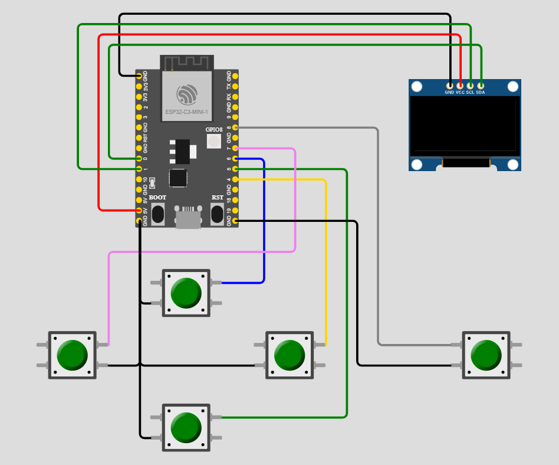

# Handheld game console project with ESP32C3
1. Introduction
    
    handheld game console with 2 single player and duo modes.
    
    gameplay: the player moves to find his way in a dark maze to find treasure

    

2. Platform is ESP-IDF v5.3.1-dirty
3. Deployment
+ clone repo

    ```
    git clone https://github.com/Zerolifes/game_esp32c3.git
    cd game_esp32c3
    ```
+ build: use **ESP-IDF CMD**

    + Before building you may have to change the information in main/pairing.c file from line 21 to line 27 and change the information in stream.py file to match your network configuration

    ```
    idf.py set-targer esp32c3
    idf.py build
    ```
+ hardware connection

    + use **SSD1306 128 x 64**
    + use **ESP32 - C3 - MINI - 1**


    

+ flash

    + connect esp32c3 with your LAPTOP or PC

    ```
    idf.py flash
    ```

+ server and stream

    ```
    python stream.py
    ```

+ interface of game

    + Start - to start single player
    + Pair-gen - to start duos with your device being the maze generator
    + Pair-find - to start duos with your device being the matchmaker

+ let's play!
